# Appdemonstrasjon

Velkommen til en visuell gjennomgang av vår applikasjon! Nedenfor finner du en serie med skjermbilder som demonstrerer nøkkelfunksjonene og brukergrensesnittet i appen.

## Innholdsfortegnelse

1. [Hjemmeside](#hjemmeside)
2. [Login](#Login)
3. [Hjemskjerm](#Hjemmeskjerm)
4. [Bruker Drikker Melk](#Drikker_melk)
5. [Profilside/instillinger](#Profilside/instillinger)
6. [Hjemskjerm etter oppdatering](#Hjemskjerm_etter_oppdatering)

---

### Hjemmeside

En veldig enkel hjememside med en login og signup knapp, samt logo.

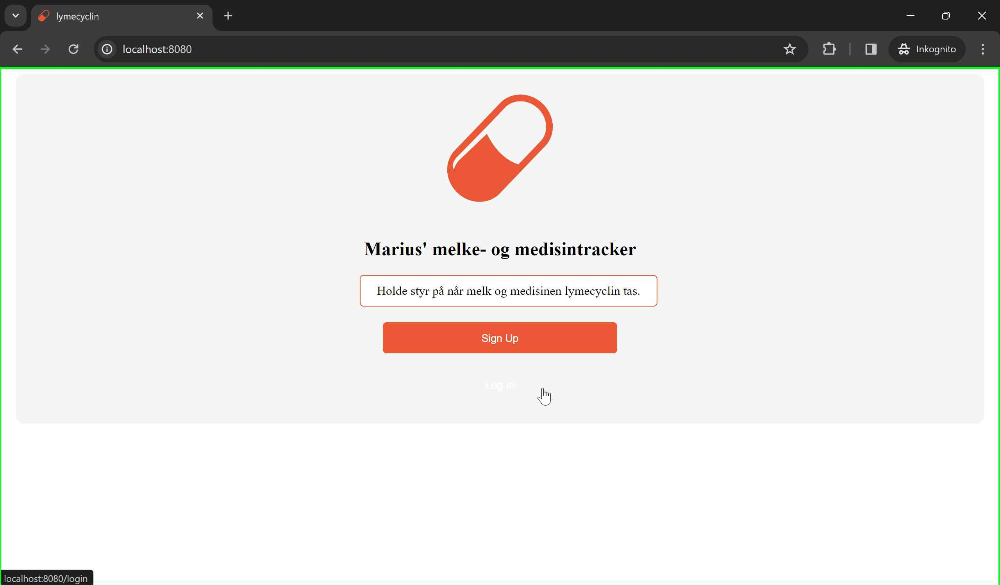

---

### Login
Enkel login-funksjon med brukernavn og passord.

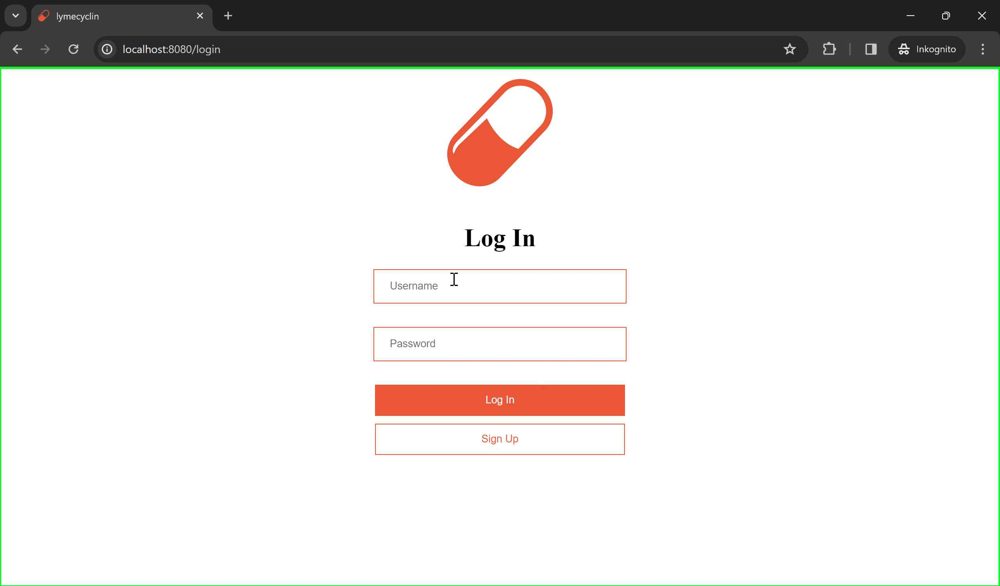

Brukeren logger inn og kommer tilbake til hjem-skermen.

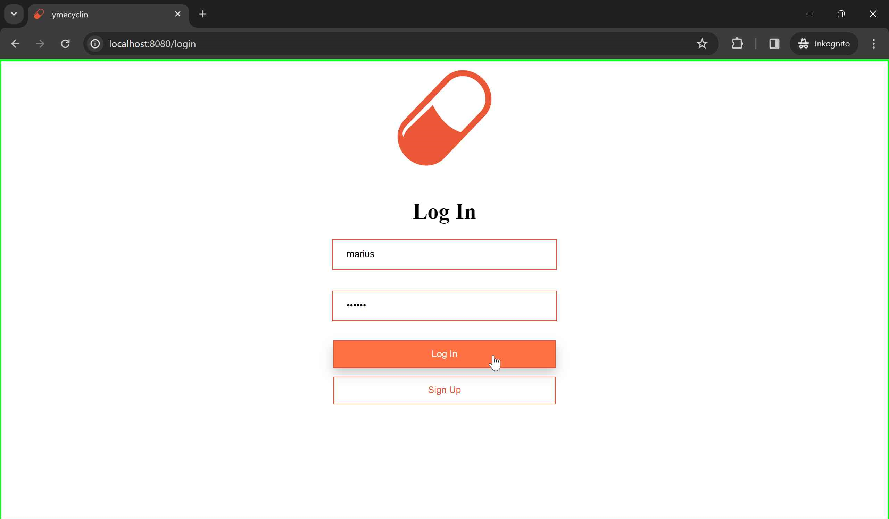

---

### Hjemskjerm

Hjemmeside før pille og melk er drukket. To knapper hvor bruker kan registrere melke- og pilleinntak. Kalender som viser hvilke dager hvor 2 piller er tatt(oransje), og hvilken dag vi er på (tekst i lyseblå).

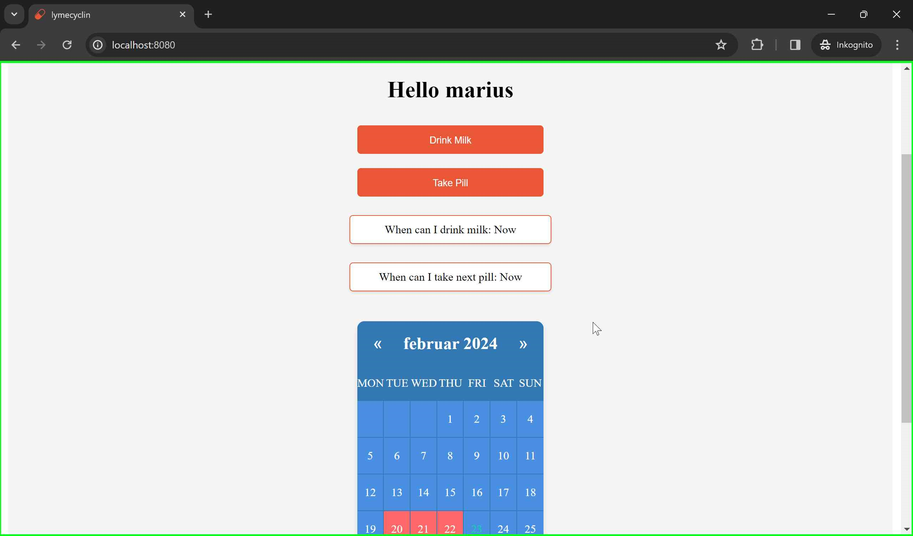

---

### Drikker_melk

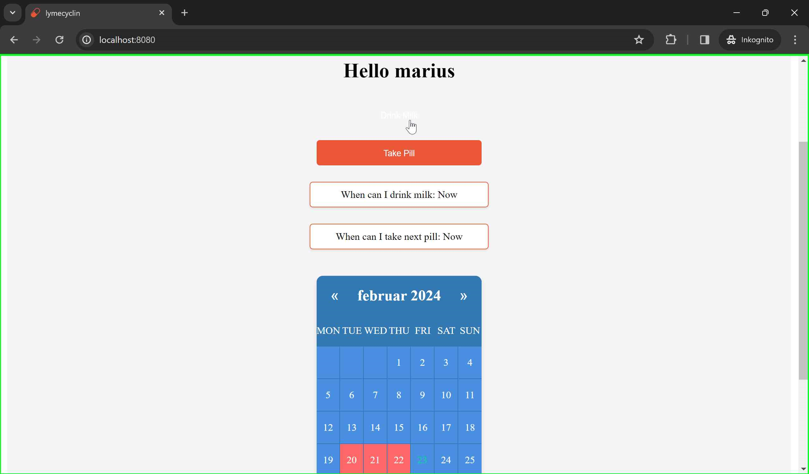

Brukeren trykker på Drink Milk, og timeren før pille kan tas blir satt til 1 time. Bruker vil få feilmelding hvis det prøves å registrere pilleinntak.

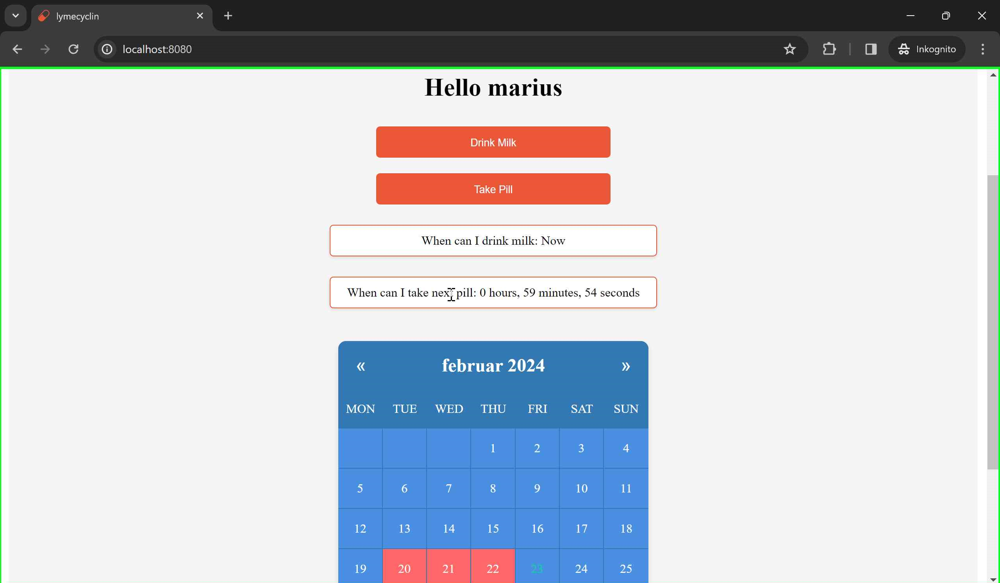

---

### Profilside/instillinger (CRUD)

Brukeren har nå entret profil-siden (knapp under kalenderen, samt en logout knapp under kalenderen også).

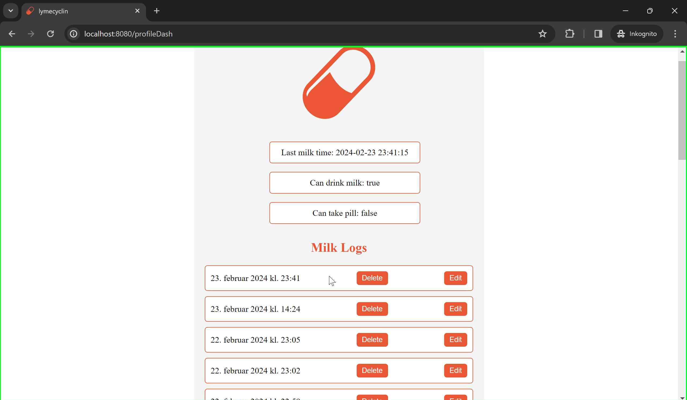

Oversikt over alle pille og melkelogger (Skal justeres til kun dagens melkeinntak). Bruker kan redigere og slette registrerte inntak, og statusen om brukeren kan ta pille/drikke melk oppdateres.

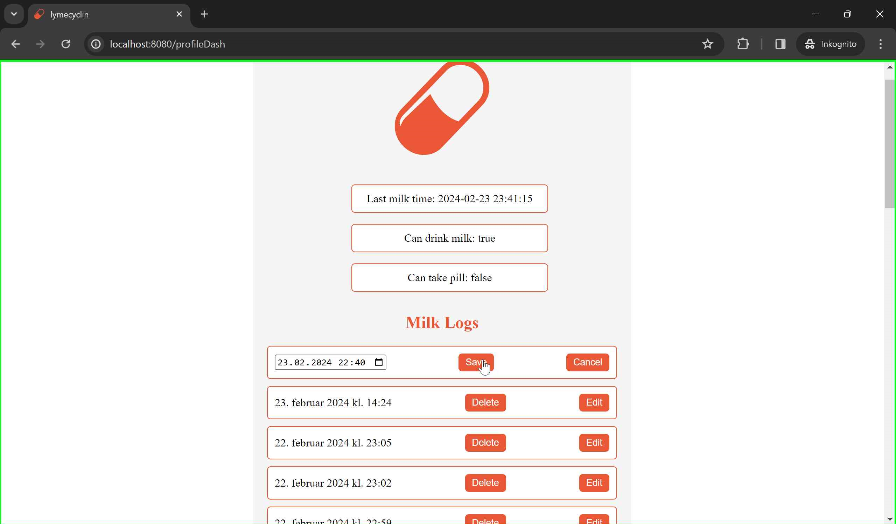

Nå kan brukeren igjen ta piller siden melkeinntaket er nå mer enn en time siden.
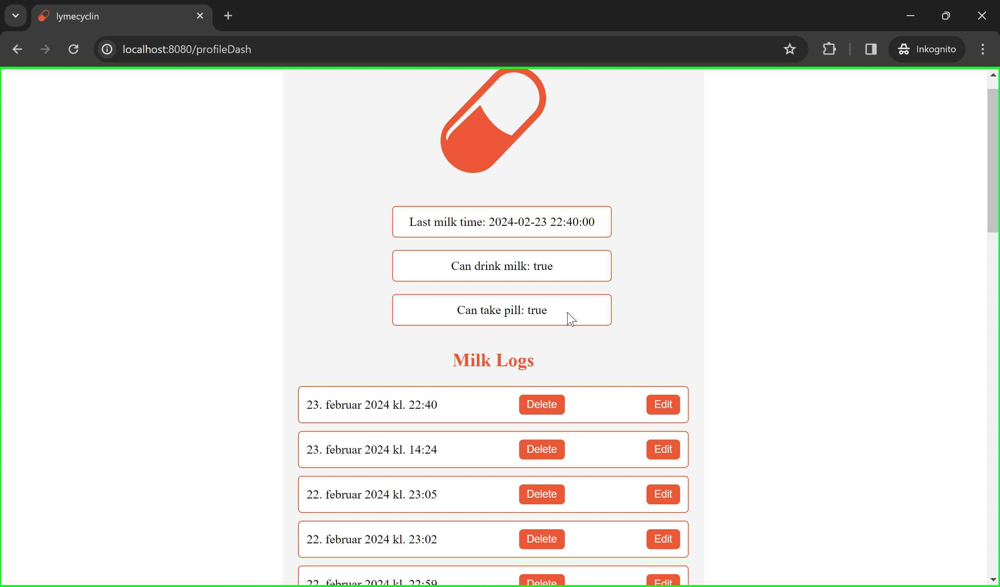

---

### Hjemskjerm_etter_oppdatering

Brukeren velger nå å ta pille ved å trykke på 'Take Pill'

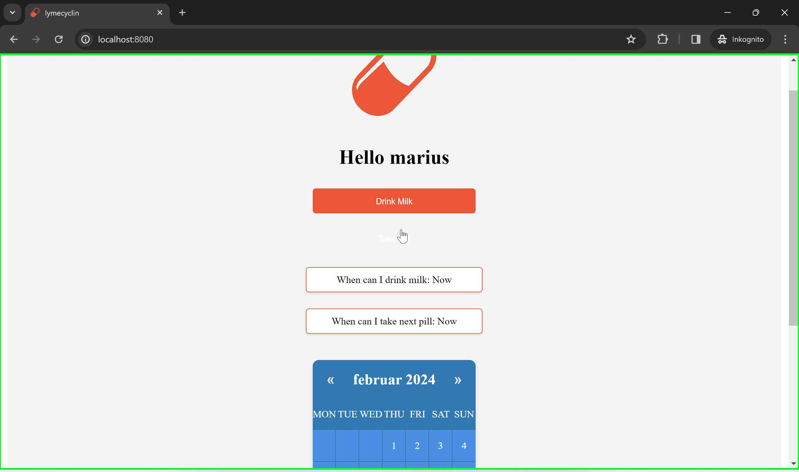

Brukeren har nå tatt 2 piller idag, og dermed markeres dagens dato med oransje boks. I tillegg er det nå minst 5 timer til neste pilleinntak som skal tas morgen og kveld.
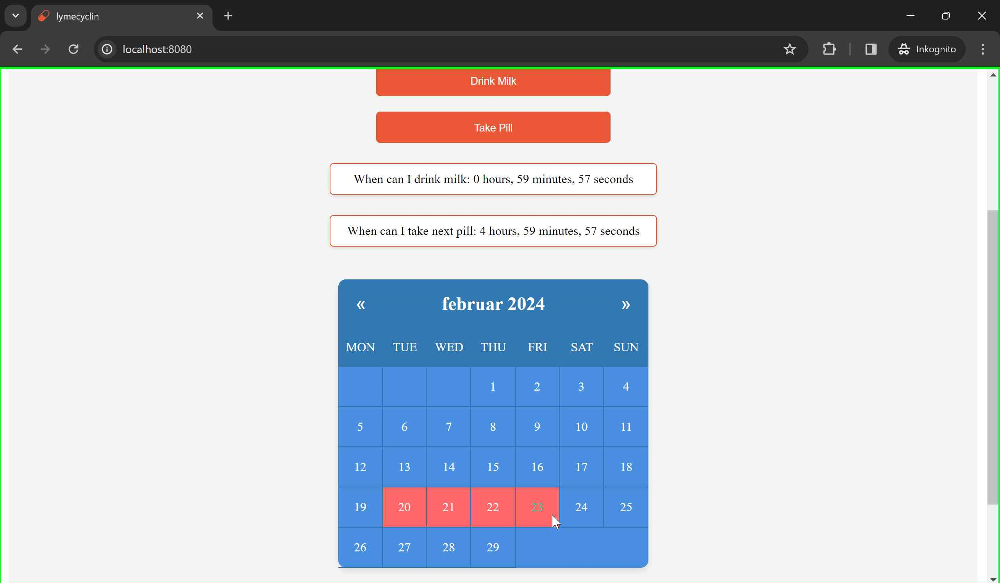

---
